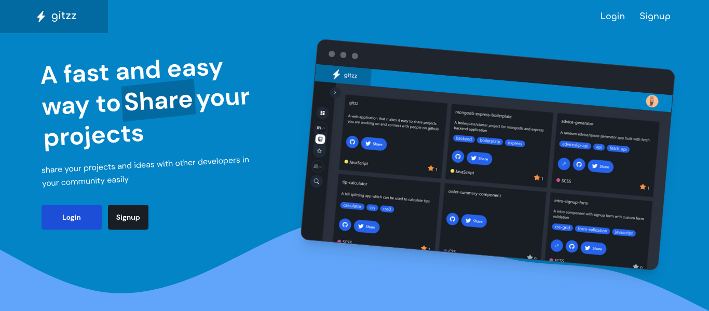

# Gittz

[](#)
[](https://twitter.com/olamide_farouq)

## Table of contents

- [Gittz](#gittz)
  - [Table of contents](#table-of-contents)
  - [About](#about)
    - [Screenshot](#screenshot)
    - [Links](#links)
    - [Built with](#built-with)
  - [Install](#install)
  - [Author](#author)
  - [Support](#support)


## About
Gittz is a web application which integrates with the github REST API making it easy for developers to share their projects on twitter and receive feedbacks from their community. it also has a search functionality for github users and repositories and a user friendly dashboard which displays data from the users github profile.

### Screenshot


### Links

- Live Site URL: [gittz](https://gittz.netify.live)

### Built with
- [React](https://reactjs.org/) - JS library
- [vite](https://vitejs.dev/) - Next Generation Frontend Tooling
- [Stitches](https://stitches.dev/) - For styles
- [Tailwind css](https://tailwindcss.com) - For styles
- [Node](https://nodejs.org/)-backend runtime environment
- [Express](https://expressjs.com/) - Node.js framework

## Install
```
yarn install
yarn run dev
```

## Author
👤 **Olamide Atitebi**

- Website: [olamide Atitebi](https://github.com/olamide203)
- Twitter: [@olamide_farouq](https://twitter.com/olamide_farouq)
- Github: [@olamide203](https://github.com/olamide203)
- 
## Support

Give this project a ⭐️ if it has helped you!